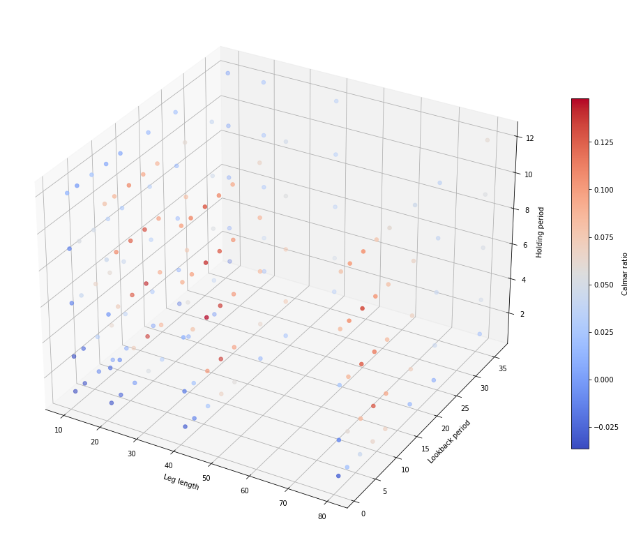
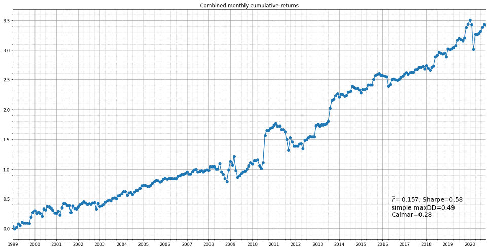
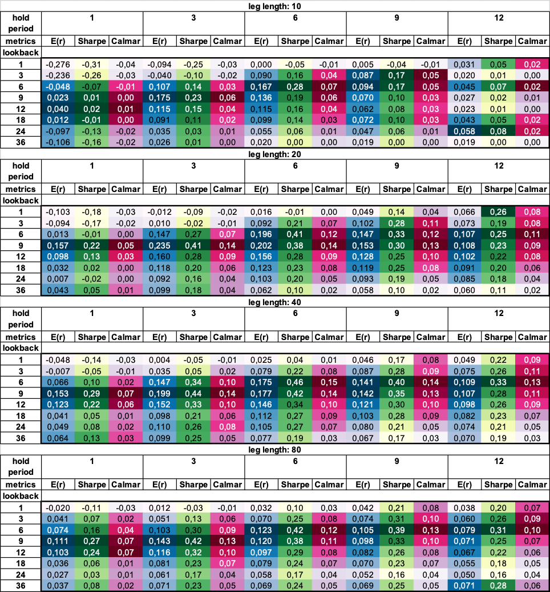

# Market-neutral strategies

This is the code used for research on my thesis, “Development of market-neutral strategies targeting global markets” (to be published online this fall). If the file doesn't open, use this link: https://nbviewer.jupyter.org/github/andrewargatkiny/market-neutral-strategies/blob/main/strategy%20implementation.ipynb. 

Keep in mind, it was designed for exploration and analysis, not for production, so it may look a little twisted and not follow best practices. Stock data is NOT included as its redistribution isn't permitted by providers.

I also included conclusion of the thesis in Russian in the repo. Main highlights and implications of the work are:

UPDATE: Now you can read  the full work at http://elib.sfu-kras.ru/handle/2311/143428. Nonetheless, I suggest you'd first read the conclusion.

# Theoretical  

## Contributions to discussion of market inefficiencies
* I found more evidence of violations in EMH (efficient market hypothesis) by backtesting algorithmic market-neutral strategies for most recent period, not covered widely in the literature (1999-2020).
* I refuted a hypothesis which suggested deterioration of cross-sectional momentum strategies’ returns after its widespread adoption and proved its nonlinear correlation with market returns during periods with profound crises, such as first decade of 21st century.
* More generally, I made a conjecture that many risk-factors based quantitive strategies continue to consistently produce excessive risk-adjusted returns as compared to market returns after their publication in academic literature. This conjecture opposes views stating that profitability of such strategies diminishes due to data-mining bias or/and widespread adoption and exploitation by professionals community which leads to elimination of market inefficiency.

## Theoretical foundation for market-neutral strategies
Also, I laid down unified theoretical framework for market-neutral quantitive strategies, classified them into two broad categories:
* Risk-factors based zero-cost long-short strategies,
* Statistical arbitrage strategies;
explored their features and derived their common and distinctive statistical properties which can be exploited to gain excessive returns.

# Empirical

## Framework for backtesting and evaluation of algo strategies
I designed a new framework for construction, bias-free backtesting and performance evaluation of algorithmic quantitive strategies. 

In particular, I’ve constructed two systems of cumulative returns evaluation — one for additive style investing (simple interest) and another for multiplicative (compound interest) — and a set of corresponding metrics for each. These sets comprise absolute and scale-invariant measures of risk-adjusted returns which take into account not only variance, but also asymmetry, kurtosis and serial dependence in their distributions. In order to achieve this, I’ve modified some existing metrics and created one totally new.

## New outperforming robust market-neutral strategies

Using this framework, I developed several algorithms of market-neutral strategies of both classes (mean-reversion based statistical arbitrage and long-short strategy based on cross-sectional momentum risk factor). The strategies strike a balance between following in footsteps of models from classical papers and bringing some innovation. They were backtested on US stock market data from 1999 till 2020 and optimized on a set of a few hyperparameters.

Portfolios consisting of single and combined strategies greatly outperformed both benchmark (S&P 500 Index) and comparable referenced models on risk-adjusted basis.

I rigorously tested the resulting set of strategies for overfitting on hyperparameters space using several techniques:
- Plotting and visual analysis of fitness functions’ (metrics) surfaces in high-dimensional space around local extremas.
- Time-series walk-forward cross-validation.
- Ranking strategies by their performance on different subperiods of the timeline and examining their deviations.

Results indicate that the most important fitness function is continuous and smooth in the domain for most types of strategies which allow to use them with confidence in real life investing.
